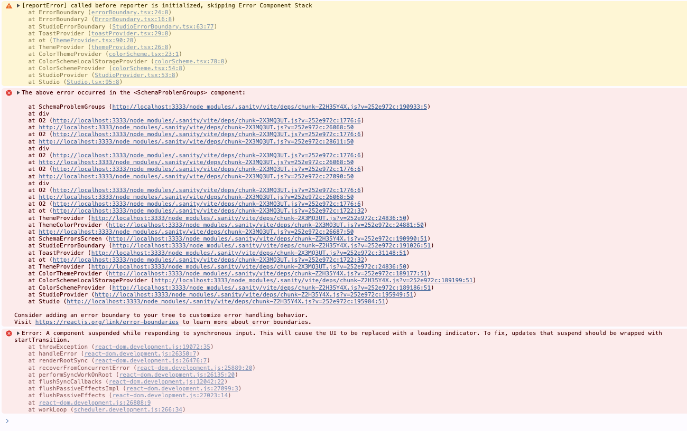

Sanity studio crashes. Un-commenting a section in `sanity.config.ts` fixes the crashing. It seems like `sanity-plugin-internationalized-array` doesn't work with multiple workspaces without plugin configuration existing in all workspaces.

